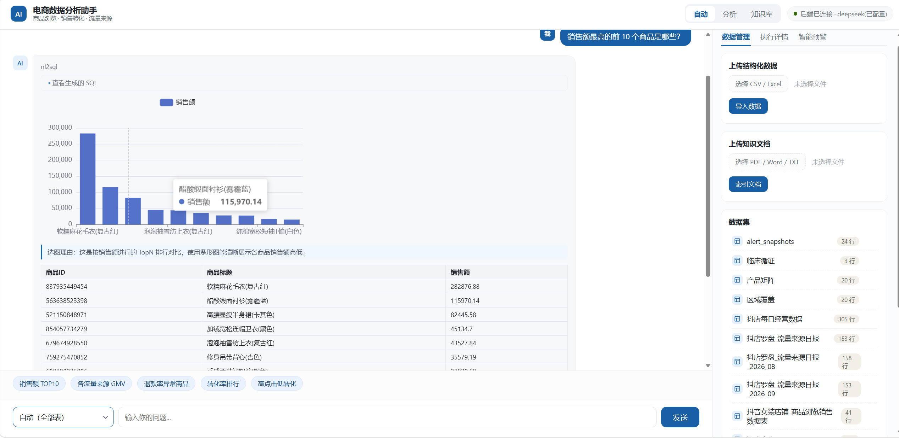
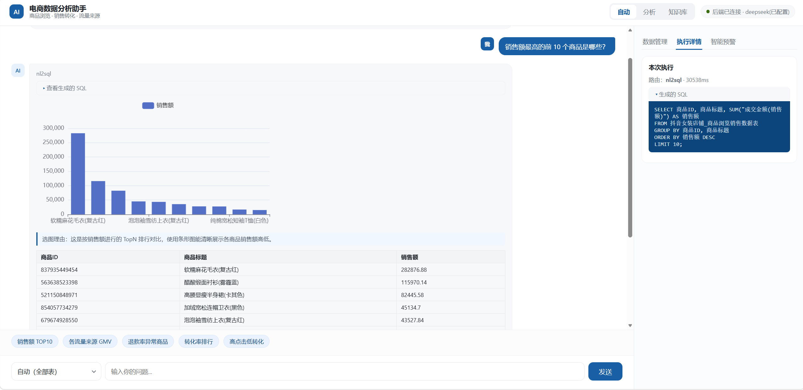
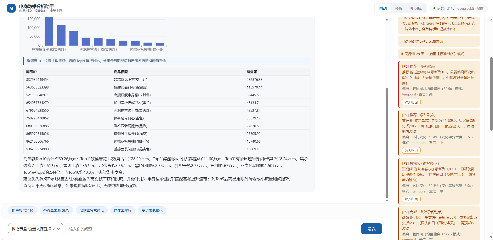

# 电商数据分析与知识问答助手

把电商经营报表变成「中文提问直接出数出图」的分析助手，并主动发现需要人工处理的异常。

面向**一个人管几十款商品的电商运营**：过去查数据要提需求、等数据组排期，问题常常等发现时已经晚了。本项目把「提数需求」压缩成一句话，并主动提示"该管却没人管"的异常。







## 核心能力

- **自然语言取数（NL2SQL）**：中文提问 → 生成 SQL → 结果表 + 图表 + 中文结论；SQL 与结果表可展开核对
- **知识问答（RAG）**：上传文档即入检索库，回答带引用来源，支持按业务域隔离检索范围
- **异常预警**：自动识别时间 / 指标 / 维度列并选择检测策略，按级别分级，每条附一键归因入口
- **生产防护**：SQL 只读安全校验、LLM 输出护栏、失败降级、歧义反问

## 技术亮点

**1. SQL 安全用语法树白名单，不是关键词黑名单**

关键词黑名单容易被绕过——`SEL/**/ECT` 这类注释混淆改一个字符就失效。本项目用 sqlglot 把 SQL 解析成语法树，只放行「单条 + 只读形状（含集合运算）」，遍历整棵树拦截写操作与递归 CTE，最后强制结果集上限。配套的**歧义反问**在问题含义不明确时，给出真实列名与取值让用户确认，而不是替用户猜。

**2. 预警把「基线」做对，而不是调阈值**

真实电商数据有周内节律（周一低、周末高）和大促 / 节日效应。只用"全月中位数"当基线，必然把正常波动误报成异常。本项目分三层处理：

- **同周几对照**——本周六 vs 历史周六，而不是 vs 全月平均
- **节日窗口日历**——由"单日"扩展为"窗口"（节前预热 + 节后影响），并纳入农历节日；按指标类型区分（流量类看节前、退款类看节后）
- **按幅度分级**——落在预期窗口内且幅度正常则降为提示级；**幅度失控保留高等级**，避免季节性豁免掩盖真异常

**3. 克隆即跑**

未填 API Key 自动回退 MockLLM；上传 CSV / Excel 即自动建表；中文检索用字符级 BM25 + 向量混合召回，默认无需下载额外嵌入模型。需要更好的语义召回时可选装 `bge` 扩展。

## 环境要求
- **Python 3.12**（已在 3.12.10 验证；低于 3.12 不支持，`pyproject.toml` 中声明 `requires-python = ">=3.12"`）
- Windows / macOS / Linux

## 快速开始

### 1. 创建虚拟环境并安装依赖
```bash
# 在项目根目录下执行
py -3.12 -m ensurepip --upgrade
py -3.12 -m venv .venv

# Windows
.venv\Scripts\python.exe -m pip install --upgrade pip
.venv\Scripts\python.exe -m pip install -r requirements.txt
.venv\Scripts\python.exe -m pip install -e .

# macOS / Linux
source .venv/bin/activate
python -m pip install --upgrade pip
python -m pip install -r requirements.txt
python -m pip install -e .
```
> 如需中文高质量向量（会额外安装 torch，约 1.5GB）：激活虚拟环境后执行 `pip install -e ".[bge]"`，并在 `.env` 设 `EMBEDDING_PROVIDER=local_bge`。

### 2. 配置
复制 `.env.example` 为 `.env`，填入你的 DeepSeek API Key：
```
DEEPSEEK_API_KEY=sk-xxxxxxxx
```
不填也能跑（MockLLM 回退）。

> 公网 / 企业部署建议：在 `.env` 设置 `API_KEY=你的密钥`（启用 `X-API-Key` 头校验）与 `CORS_ORIGINS=https://你的前端域名`，避免默认的全开 CORS 与免鉴权。

### 3. 启动服务
```bash
# Windows
.venv\Scripts\python.exe run.py

# macOS / Linux（激活虚拟环境后）
python run.py
```
浏览器打开 http://127.0.0.1:8000

> **关于数据**：服务启动后数据库为空，需在界面「数据管理」上传 CSV/Excel 即自动建表，之后即可对话查询；或实现 `data/warehouse_source.py` 接真实数仓。

## 用 PyCharm 打开运行
1. `File → Open` 选择项目根目录。
2. PyCharm 通常会自动识别 `.venv`；若没有，`Settings → Project → Python Interpreter` 选择 `.venv\Scripts\python.exe`（macOS / Linux 为 `.venv/bin/python`）。
3. 右键 `run.py` → `Run 'run'`；或在终端执行上方命令。
4. 在 `.env` 填 `DEEPSEEK_API_KEY` 切换真实模型。

## 目录结构
```
src/ecommerce_ai/
├── core/        配置、日志、数据模型
├── llm/         DeepSeek / MockLLM 工厂
├── data/        数据源适配器、上传落库
├── rag/         文档加载、嵌入、检索、索引
├── alerting/    数据画像、异常检测规则、快照
├── tools/       LangChain Tool 封装
├── agents/      LangGraph 编排与各节点
└── api/         FastAPI 路由
configs/         提示词模板与设置
frontend/        前端单页
docs/            文档与截图
```

## 接真实数据
- 结构化数据：实现 `data/warehouse_source.py`，在 `.env` 设 `DATA_SOURCE=warehouse`，业务代码零改动。
- 或直接在界面"数据管理"上传 CSV/Excel。
- 文档：在界面或 `POST /api/v1/knowledge/upload` 上传，自动进 RAG。

## 主要 API
| 方法 | 路径 | 说明 |
|---|---|---|
| POST | /api/v1/chat | 对话（流式 SSE） |
| POST | /api/v1/query | 单轮分析，返回 SQL/结果/图表/解读 |
| GET  | /api/v1/knowledge/search | RAG 检索 |
| POST | /api/v1/data/upload | 上传结构化数据 |
| POST | /api/v1/knowledge/upload | 上传文档 |
| GET  | /api/v1/datasets | 数据集列表 |
| POST | /api/v1/alerts/scan | 触发预警扫描 |
| GET  | /api/v1/health | 健康检查 |

## 测试

```bash
# Windows
.venv\Scripts\python.exe -m pytest

# macOS / Linux
python -m pytest
```

测试覆盖 SQL 只读安全校验、数据画像与指标列识别、异常检测规则（含误报回归用例）。

## 已知局限与后续计划

以下均为当前实现的**已知取舍**，不是缺陷清单遗漏：

| 局限 | 现状 | 后续方向 |
|---|---|---|
| 检索语义 | 默认使用轻量嵌入，同义改写类提问可能召回不足（BM25 可兜住关键词命中） | 接入 `bge-small-zh`，或扩展为"关键词 + 向量 + 重排" |
| 预警基线样本 | 同周几基线需 2~3 周以上数据才充分发挥，短跨度时统计功效受限 | 累积更长跨度 + 分层基线 |
| 多轮记忆 | 以单轮分析为主，追问缺少上下文 | 引入会话状态与 checkpointer |
| 数据源 | 默认本地 SQLite（Mock），Excel 上传即建表 | 实现 `warehouse_source` 接真实数仓 |
| 评测 | 尚无自动化的取数准确率评测 | 建立标注题库与准确率 / Recall 门禁 |

## 常见问题

### Windows 启动报 `ImportError: DLL load failed while importing _uuid_utils`

这是 **Windows「智能应用控制」拦截了第三方依赖的加载**，与项目代码无关。

`langchain-core` 1.x 依赖 `uuid-utils`（Rust 编译扩展，仅用于生成 `uuid7` 追踪 ID）。部分 Windows 环境（新装或重置后的 Windows 11，以及启用了 WDAC 策略的电脑）会阻止该 `.pyd` 文件加载，导致导入链路整体失败。

**解决办法**：`设置 → 隐私和安全性 → Windows 安全中心 → 应用和浏览器控制 → 智能应用控制 → 关闭`。

> 若该开关本来就是关闭状态，说明拦截来自 WDAC 组策略（多见于公司或学校统一管理的电脑），需联系 IT 放行。macOS / Linux 不存在此问题。

### 启动后数据库是空的，提问查不到数据？

首次启动会自动创建空库，这是预期行为。请先在界面「数据管理」上传 CSV / Excel（上传后自动建表），之后即可对话查询。详见上方「接真实数据」。

### 没填 API Key 能跑吗？

可以。`.env` 未填 `DEEPSEEK_API_KEY` 时会自动回退到 MockLLM，对话流程、SQL 生成、图表与中文解读链路均可在无密钥、无外网的情况下完整演示。

## License

MIT
